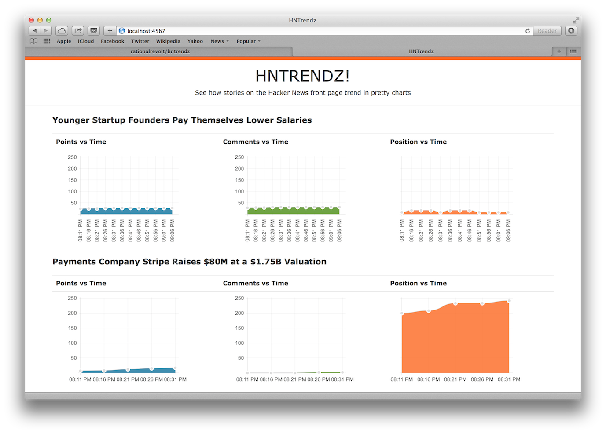

# Hntrendz

Capture and chart trending information for Hacker News

## Screenshot

## See it Online

[http://apps.defsym.me/hntrendz](http://apps.defsym.me/hntrendz)

## Installation

Clone this repository into a folder of your choice

    $ git clone https://github.com/rationalrevolt/hntrendz.git

To install dependencies:

    $ bundle install

Setup the development database:

    $ sequel -m db/migrations/ sqlite://db/hntrendz.db

To launch the Sinatra app:

    $ ruby hntrendz.rb

To start the background process that fetches stories from Hacker News:

    $ bundle exec clockwork lib/hntrendz/jobs/clock.rb

## Contributing

1. Fork it ( http://github.com/rationalrevolt/hntrendz/fork )
2. Create your feature branch (`git checkout -b my-new-feature`)
3. Commit your changes (`git commit -am 'Add some feature'`)
4. Push to the branch (`git push origin my-new-feature`)
5. Create new Pull Request
